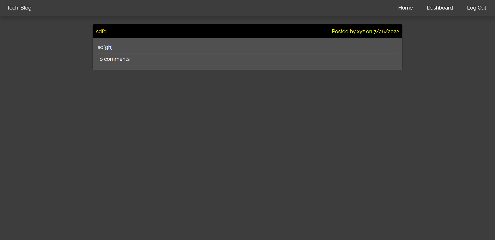

# Professional Readme

## Description

-  In today's era of technology, everybody is using the digital blogs to exchange information.

- To achieve my goal, I created this application. In this application you can type in the contents, and it will create the blog post for you.

- It will make the hectic life of today's human a bit easy. Thus giving them a siegh of relief, as they it will give them easy and free access to blogs.

-Java script was totally new to me, so I learned it and used them in a way which enhances my understanding of it.

## Table of Contents

installation
-installation
-Download and install Git bash
-Open your Git bash application
-Type in command mkdir mvc
-By using cd command go into mvc
-Enter git clone https://github.com/sachmilan/mvc.git

## Credits

Sachmilan Singh

## Usage

Using this techblog application is really easy. All tou have to type in the the command line the information you want to include and it will make the professional readme file for you.

https://sachmilan.github.io/mvc/

## Features

It is extreamly user friendly, all you need is a working device and you are all set to use it. 

## How to contribute

You can always look at the JavaScript code which I use. I trust myself completely; however, not a single man on this earth is perfect, so if you find a better way to code the techblog, or find any fault in my code, feel free to contact me on Linkedin, Github and Gmail, all you have to do is to search my name- Sachmilan Singh.
